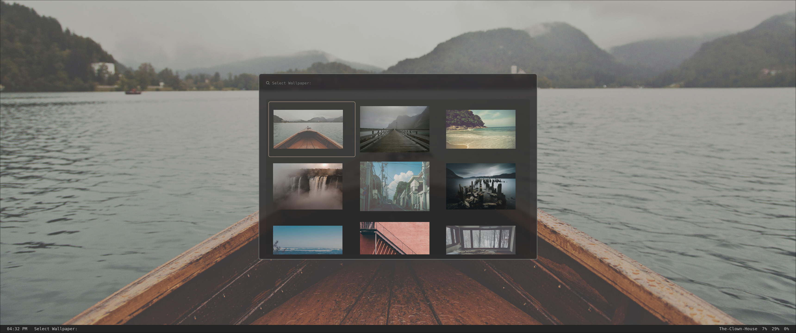
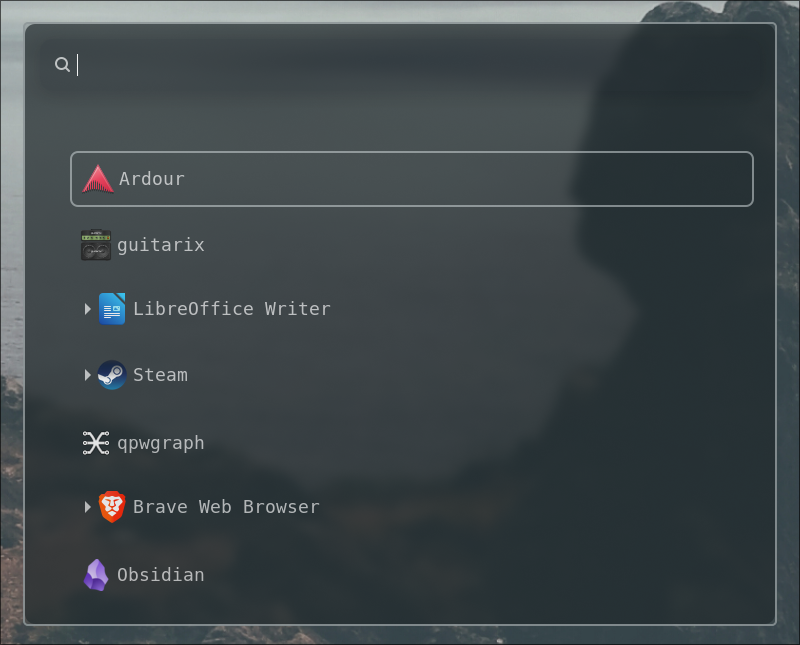
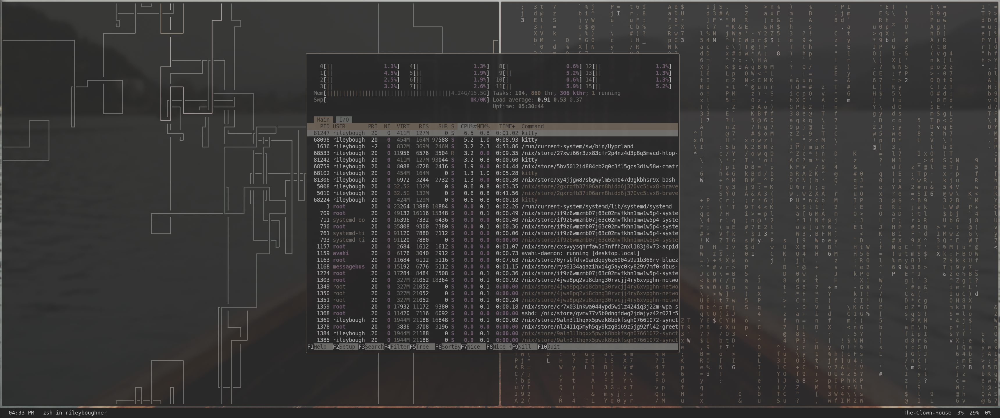

# Riley Boughners' Dotfiles
## About
### Welcome to my dotfiles! These contain all of my most important configuration settings for all of my machines. I like trying to find the best balance of functionality and aesthetic. 

## TODO!

- [ ] Spring cleaning
- [ ] Make Bitwarden Authentication a popup in hyprland window rules
- [ ] Determine robust solution for syncing files between all computers (Ive tried syncthing and nextcloud but I dont really like them)
- [ ] Create Fork of wallpaper repo so that I can include my own custom wallpapers
- [ ] Complete script for automating the installation of the system on any device
- [ ] Create a custom installation Media
