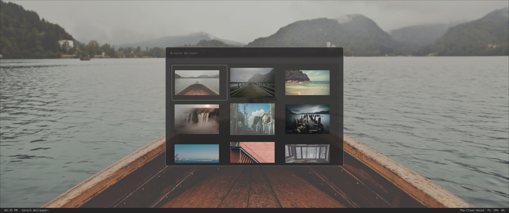
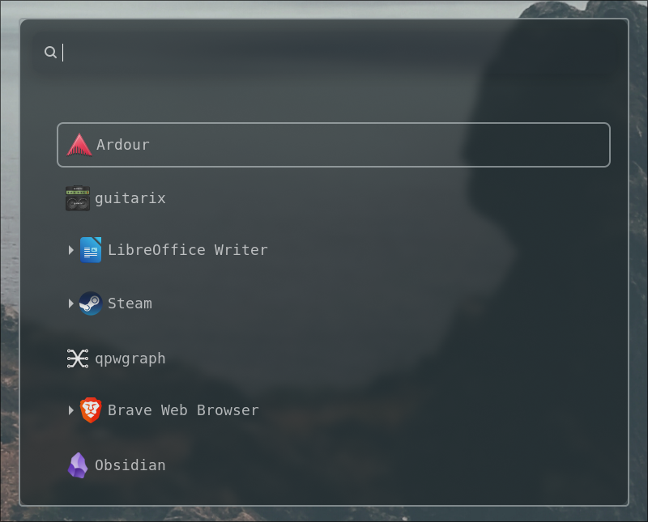
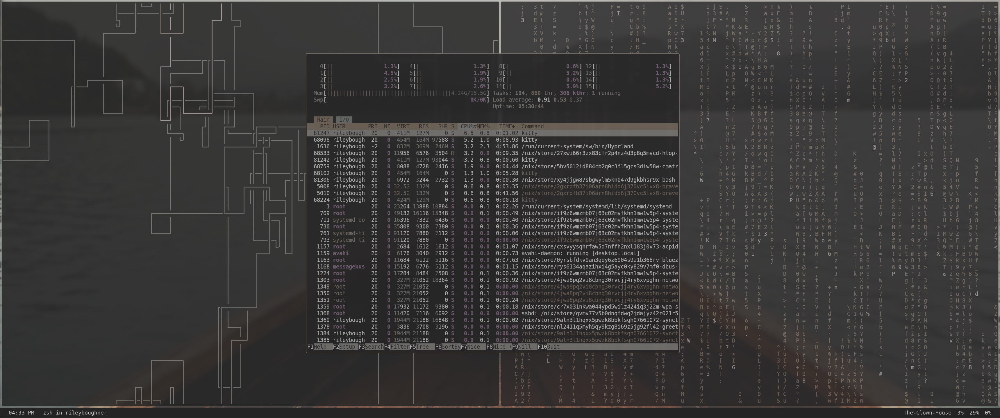

# Riley Boughners' Dotfiles

## About
Welcome to my dotfiles! These contain the configuration and automation I use across my machines. The goal is a balance of functionality and aesthetics.

## Repository layout
- `nixos/`: NixOS flake, system configuration, and Home Manager entry points.
- `scripts/`: Helper scripts for rebuilding, theming, and syncing.
- `dotfiles/`: Additional dotfiles (tracked for future expansion).
- `.images/`: Screenshots showcased above.

## Quick start
> These instructions assume the repo is checked out as `~/.system`.

1. Review the NixOS configuration:
   - `nixos/flake.nix`
   - `nixos/configuration.nix`
   - `nixos/home-manager.nix`
2. Rebuild the system:
   ```bash
   ~/.system/scripts/rebuild
   ```
3. Update and commit flake inputs:
   ```bash
   ~/.system/scripts/update
   ```

## Scripts
| Script | Purpose |
| --- | --- |
| `scripts/rebuild` | Runs `nixos-rebuild switch` for the local flake. |
| `scripts/update` | Updates flake inputs and commits `flake.lock` if it changed. |
| `scripts/change-wallpaper` | Picks a wallpaper with Wofi, sets Hyprpaper, and updates the theme. |
| `scripts/set-theme-from-wallpaper` | Runs `pywal` and applies colors to Firefox, Mako, and more. |
| `scripts/backup` | Syncs backups from the `server` host with `rsync`. |
| `scripts/cloud` | Mounts the `server` cloud directory with `sshfs`. |

## Theming workflow
1. Place wallpapers in `~/.wallpapers`.
2. Run:
   ```bash
   ~/.system/scripts/change-wallpaper
   ```
3. The script copies the selected image to `~/.wallpaper`, updates Hyprpaper, and calls `set-theme-from-wallpaper`.

## TODO!

- [ ] Spring cleaning
- [ ] Make Bitwarden Authentication a popup in hyprland window rules
- [ ] Determine robust solution for syncing files between all computers (Ive tried syncthing and nextcloud but I dont really like them)
- [ ] Create Fork of wallpaper repo so that I can include my own custom wallpapers
- [ ] Complete script for automating the installation of the system on any device
- [ ] Create a custom installation Media
